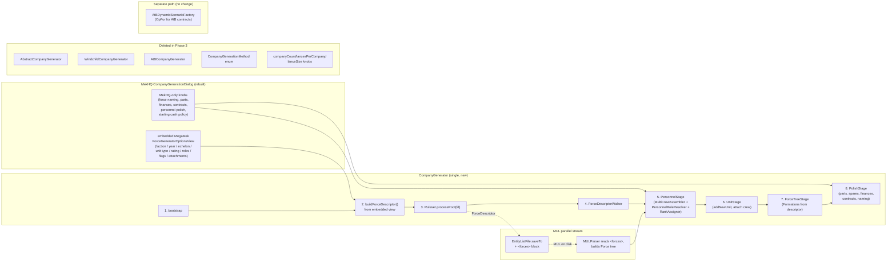

# MekHQ Company Generation: full replacement on the MegaMek Force Generator

## Context

Players ask MekHQ's Company Generator for two things it can't deliver today:
1. **Non-Mek combat units** as primary forces — tank battalions, infantry regiments, BA companies, aero wings.
2. **Forces up to Regiment / Cluster / Galaxy scale.**

The current architecture can't grow to either: `AbstractCompanyGenerator.generateCombatPersonnel` hard-codes `PersonnelRole.MEKWARRIOR`, `generateMekSummary` / `generateEntity` only call `getUnitGenerator().generate(faction, UnitType.MEK, ...)`, and the UI is a flat `companyCount × lancesPerCompany × lanceSize` cap (~180 personnel) with no unit-type knob.

The pieces to do everything we want **already exist on MegaMek's side**. The Force Generator (tab 6 of `RandomArmyDialog`, driven by `ForceGeneratorOptionsView` + `Ruleset.processRoot`) is rule-driven by 57 faction XML files in `data/forcegenerator/faction_rules/`, covers IS / Periphery / Clan / ComStar from Lance / Star up to Regiment / Galaxy / Touman, supports combined-arms (e.g. an FS RCT = Mek Regiment + Tank Brigade + Infantry Brigade + 2 Aero Wings under one DIVISION), is era-aware via `ifDateBetween`, and produces a `ForceDescriptor` tree whose shape matches MekHQ's `Force` tree.

**Approach (per Dave + user):** **full replacement** of MekHQ's player-starting-force company-generation architecture. The user-facing functionality survives — personnel polish, callsigns, education, ranks, parts, spares, finances, contracts, force naming, presets — but the structural / unit-selection layer is replaced wholesale by the MegaMek Force Generator. The Windchild and AtB starting-force strategies, the `companyCount × lancesPerCompany × lanceSize` model, and `AbstractCompanyGenerator`'s Mek-only assumptions all go away. The MegaMek Force Generator UI is embedded inside the MekHQ dialog and supplies the unit structure; MekHQ-only controls sit beside it.

**OpFor generation is a separate code path and stays untouched.** Verified against the MekHQ repo on GitHub: `AtBCompanyGenerator` is a *starting-force* preset selected via `CompanyGenerationMethod.AGAINST_THE_BOT` (sibling to `WindchildCompanyGenerator`, both extending `AbstractCompanyGenerator`). Enemy forces for AtB contracts are built by `mekhq.campaign.mission.AtBDynamicScenarioFactory`, which calls `campaign.getUnitGenerator()` / `RandomUnitGenerator` directly and contains no references to `AtBCompanyGenerator`. Deleting `AtBCompanyGenerator` therefore does not affect OpFor generation; only the AtB-flavored *starting-force preset* is removed, with its distinguishing behaviors (faction-aware rank rules, SLDF/Star League era unit pickup) ported as option toggles on the new pipeline.

A parallel MUL workflow enriches MUL files with a `<forces>` metadata block on export and reconstructs the structure on import.

## Outcome

- **One** player-starting-force company-generation pipeline in MekHQ, built on `Ruleset.processRoot`. No method dropdown.
- Non-Mek units and Regiment-scale generation are first-class.
- Existing personnel/finance/parts/contract logic is rehomed onto the new pipeline, scaling off actual leaf count rather than `companyCount × lancesPerCompany`.
- `WindchildCompanyGenerator`, `AtBCompanyGenerator`, and `AbstractCompanyGenerator` deleted. Their non-structural behaviors (Windchild's cash policy, AtB's faction-aware rank rules and SLDF unit pickup) become option toggles on the single new generator.
- OpFor generation (`AtBDynamicScenarioFactory`) is a separate code path and remains untouched.
- Saved presets migrate forward (see Migration); no silent breakage of existing campaigns.
- MUL files exported by MegaMek carry a `<forces>` block; MekHQ imports the structure into its `Force` tree.

## Verified facts (MegaMek side, this checkout)

- `Ruleset.processRoot(ForceDescriptor, ProgressListener)` at `Ruleset.java:182` runs `defaults.apply` → `buildForceTree` → `generateUnits` → `recalcWeightClass` → `assignCommanders` → `assignPositions` → `loadEntities` → `assignTransport`. Null listener is guarded throughout.
- `Ruleset.findRuleset(String)` at `:131` walks `FactionRecord.getParentFactions()` and ultimately returns `new Ruleset()` (defaults-only) so a missing-faction call never NPEs.
- `Ruleset.directory` at `:87` is `private static final String "data/forcegenerator/faction_rules"`. `Ruleset.loadData()` at `:392` reads it once.
- `ForceDescriptor` exposes `getSubForces`, `getAttached`, `getCo`, `getXo`, `getCoRank`, `getEntity`, `getEchelon`, `getEchelonCode`, `getFaction`, `getUnitType`, `getRating`, `getExperience`, `isAugmented`, `getName`, `getFluffName`, `getIndex`, `getYear`. Recursion in `loadEntities` and `addAllEntities` already covers `subForces` and `attached`.
- `ForceDescriptor.loadEntities` already sets `entity.setForceString(...)` per leaf (`ForceDescriptor.java:891`); `EntityListFile.java:1302` round-trips a path-style hierarchy via `<entity>...<force force="Name|id||..."/></entity>`. The MUL `<forces>` block is *additional richer metadata*, not "preserve the tree" (already preserved, just lossy).
- `ForceGeneratorOptionsView extends JPanel`, constructor `(Consumer<ForceDescriptor> onGenerate, GameOptions gameOptions)` (`:141`). `Ruleset.loadData()` runs lazily in the constructor. `generateForce()` (`:481`) packages the user's selections into a fresh `ForceDescriptor` and runs it through `Ruleset.findRuleset(fd).processRoot(fd, this)` in a `SwingWorker` (`:1075`); on `done()` it calls `onGenerate.accept(forceDesc)` (`:1084`). This is the embed seam.

---

## Shape



---

## Phase plan (sequence)

The replacement lands progressively. The old generator stays callable until Phase 3 to keep main green and preserve a fallback during the migration pass.

### Phase 1 — New pipeline, behind a flag

Land the full new pipeline alongside the old one, gated by a system property / dev option. Old `CompanyGenerationMethod` choices still work; `RULESET_BASED` is a third, hidden choice. Mek-only at this stage to keep the diff bounded.

**MegaMek-side refactor (small):**
- `megamek/src/megamek/client/ui/dialogs/randomArmy/ForceGeneratorOptionsView.java`
  - Extract the descriptor-build block from `generateForce()` (`:482-585`) into `public ForceDescriptor buildForceDescriptor()`. Keep `generateForce()` as `processRoot(buildForceDescriptor())` inside the existing SwingWorker.
  - Add `setGenerateButtonVisible(boolean)`, `setExportMULButtonVisible(boolean)`, `setClearButtonVisible(boolean)`, `setOnExportMUL(Consumer<ForceDescriptor>)` so an embedder can hide/replace the bottom controls.

**New classes (MekHQ):**
- `mekhq.campaign.universe.companyGeneration.ratgen.CompanyGenerator` — the single entry point. `generate(Campaign, CompanyGenerationOptions)` runs the 8-step pipeline above. **No** subclassing; stages are composed from helpers.
- `mekhq.campaign.universe.companyGeneration.ratgen.RulesetEngineBootstrap` — idempotent `static ensureLoaded(int year)`: `RATGenerator.loadYear(year)`, `MekSummaryCache` warmup, `Ruleset.loadData()` if not initialized, `RandomNameGenerator.getInstance()`.
- `mekhq.campaign.universe.companyGeneration.ratgen.ForceDescriptorWalker` — pre-order visitor over `subForces` + `attached`, yields `(parentFormation, currentFormation, leafEntity, leafCrewDescriptor)`.
- `mekhq.campaign.universe.companyGeneration.ratgen.CrewDescriptorAdapter` — seeds a `Person` from a `CrewDescriptor` (name, gunnery, piloting, rank index).
- `mekhq.campaign.universe.companyGeneration.ratgen.MultiCrewAssembler` — sole owner of crew-size logic. Reads `entity.defaultCrewType()`, `entity.getCrew().getSlotCount()`, `Infantry.getOInternal(0)`, `BattleArmor.getSquadSize()`, `Aero.getNCrew()`/`getNGunners()`. Phase 1 keeps Mek-only behavior; full table lights up in Phase 2.
- `mekhq.campaign.universe.companyGeneration.ratgen.PersonnelRoleResolver` — `(int unitType, Entity) → (primary role, crew-mate roles)`. Phase 1 returns `MEKWARRIOR` only; Phase 2 fills in the rest.
- `mekhq.campaign.universe.companyGeneration.ratgen.RankAssigner` — single tree walk; reads `fd.getCoRank()` and applies via `Faction.getRankSystemCode()` to the right `Person`.
- `mekhq.gui.panels.RulesetCompanyGenerationOptionsPanel` (provisional name; becomes *the* panel in Phase 3) — embeds `ForceGeneratorOptionsView` with `setGenerateButtonVisible(false)` + `setExportMULButtonVisible(false)`. Has a getter for the embedded view so the dialog can call `buildForceDescriptor()` at submit time. Below it lives a placeholder for the lifted MekHQ-only controls (filled in Phase 3).

**Touched (MekHQ, Phase 1, additive only):**
- `mekhq.campaign.universe.enums.CompanyGenerationMethod` — add `RULESET_BASED` value (still alongside `WINDCHILD` / `AGAINST_THE_BOT`). Filtered out of the dialog dropdown unless dev flag set.
- `mekhq.campaign.universe.companyGeneration.CompanyGenerationOptions` — add `ForceDescriptorSnapshot` field (faction, year, echelon, unitType, rating, experience, weightClass, flags, augmented, sizeMod, roles, dropshipPct, jumpshipPct, cargo). Default-on-missing in `parseFromXML`.
- `mekhq.gui.dialog.CompanyGenerationDialog` — when method = `RULESET_BASED`, swap the right-side panel to `RulesetCompanyGenerationOptionsPanel` and route submit to `CompanyGenerator.generate(...)` instead of the old strategy.

**Polish stage in Phase 1.** The `PolishStage` initially calls into the existing `AbstractCompanyGenerator` helpers via static utility extraction (next phase moves them out of the abstract class). Specifically: spares generation, finance generation, contract generation, and force naming each become small static helpers in a new `mekhq.campaign.universe.companyGeneration.polish.*` package, copy-then-adapt from `AbstractCompanyGenerator`. The new copies key off the leaf count from the walker, not `determineNumberOfLances()`. The originals remain in place for the legacy strategies.

**Verification gate:** generate a FedSuns Mek Company at 3025 Regular through the new pipeline (dev flag on). Compare to a Windchild output at the same parameters: same unit count, same Mek-only composition, same parts/finance flow.

### Phase 2 — Non-Mek units + multi-crew

No new UI work — the embedded `ForceGeneratorOptionsView` already exposes unit type, role checkboxes, flag selection.

**Filled in:**
- `MultiCrewAssembler` — full implementation across `MEK / TANK / VTOL / NAVAL / INFANTRY / BATTLE_ARMOR / AEROSPACE_FIGHTER / CONV_FIGHTER / DROPSHIP / JUMPSHIP / WARSHIP / SMALL_CRAFT / PROTOMEK / LAND_AIR_MEK`. Commander seeded from `CrewDescriptor`; remaining crew from `AbstractPersonnelGenerator` with skills cloned from commander.
- `PersonnelRoleResolver` — full table:
  - `MEK` / `LAND_AIR_MEK` → `MEKWARRIOR`.
  - `TANK` / `VTOL` / `NAVAL` → `GROUND_VEHICLE_DRIVER` / `VTOL_PILOT` / `NAVAL_VEHICLE_DRIVER` + (slotCount−1) × `VEHICLE_GUNNER`.
  - `INFANTRY` → squad of `SOLDIER` sized by `Infantry.getOInternal(0)`. Promote one to `INFANTRY` officer when descriptor was a unit CO.
  - `BATTLE_ARMOR` → squad of `BATTLE_ARMOUR` sized by `BattleArmor.getSquadSize()`.
  - `AEROSPACE_FIGHTER` → `AEROSPACE_PILOT`. `CONV_FIGHTER` → `CONVENTIONAL_AIRCRAFT_PILOT`.
  - `DROPSHIP` / `JUMPSHIP` / `WARSHIP` / `SMALL_CRAFT` → `VESSEL_PILOT` + `VESSEL_CREW` + `VESSEL_GUNNER` + `VESSEL_NAVIGATOR` sized off the entity.
  - `PROTOMEK` → `PROTOMEK_PILOT` (point of 5 = 5 pilots).

**Verification gate:** "House Davion Tank Battalion 3025" produces 3 companies × 4 lances × 5 vehicles, each with driver + correct gunner count, all under named Battalion → Company → Lance Formations.

### Phase 3 — Replacement

The new pipeline becomes *the* player-starting-force pipeline. Both legacy starting-force strategies are deleted. Saved presets migrate forward. OpFor generation (`AtBDynamicScenarioFactory`) is on a separate path and is not touched.

**Deleted (MekHQ):**
- `mekhq.campaign.universe.generators.companyGenerators.AbstractCompanyGenerator`.
- `mekhq.campaign.universe.generators.companyGenerators.WindchildCompanyGenerator`.
- `mekhq.campaign.universe.generators.companyGenerators.AtBCompanyGenerator`.
- `mekhq.campaign.universe.enums.CompanyGenerationMethod`.
- Structural fields on `CompanyGenerationOptions`: `companyCount`, `lancesPerCompany`, `lanceSize`, `starsPerCluster`, anything else that exists only to size the flat-list generator.

**AtB-flavor port (so the AGAINST_THE_BOT preset's behaviors aren't lost):**
- `AtBCompanyGenerator.generateCommandingOfficerRank()` — faction-aware rank offset (lower for ComStar/WoB) → port into `RankAssigner` as a `factionRankPolicy(faction)` lookup.
- `AtBCompanyGenerator.generateMekSummary()` — Star League era unit table preference (Royal SLDF, then SLDF, then current-era faction) → port as a `preferStarLeagueTablesIfAvailable` option toggle on `CompanyGenerationOptions`. Wire into the descriptor build so when the option is on, the descriptor's faction is pre-substituted with `SL` or `SL.R` for matching years.

**Renamed/promoted:**
- `RulesetCompanyGenerationOptionsPanel` → `CompanyGenerationOptionsPanel` (the original is deleted; Phase 3 replaces it). The lifted MekHQ-only controls land here permanently: `ForceNamingMethod` selector, personnel polish toggles, parts/spares generation, contract generation, finance generation, faction-standard parts toggle, starting cash policy.
- The dialog's method dropdown disappears — there is one path.

**Migration:**
- `CompanyGenerationOptions.parseFromXML` keeps reading the old fields when present and produces a `ForceDescriptorSnapshot`:
  - `companyCount = 0..1` & `lancesPerCompany ≤ 4` → echelon=Lance.
  - Otherwise companyCount × lancesPerCompany ≤ ~12 → echelon=Company.
  - Otherwise → echelon=Battalion.
  - unitType=MEK, rating from existing `forceRating`, experience from existing `experience`, weightClass=null (let ruleset decide).
- A campaign-options migration logs once per campaign load when an old preset is encountered: "Migrated old company-generation preset to ruleset-based echelon=X."
- `CompanyGenerationMethod` references in user save files map to no-op on read; on next save, the field is dropped.

**Polish-stage rehoming:**
- The static helpers introduced in Phase 1 (`mekhq.campaign.universe.companyGeneration.polish.*`) become the canonical implementations. Originals in the deleted classes are removed.
- `determineNumberOfLances()` and similar accessors are replaced by `walker.getLeafCount()` / `walker.getLanceEquivalentCount()` exposed on the descriptor walker.

**Verification gate:**
- "Lyran Commonwealth Combined-Arms Regiment 3050 Veteran" produces one REGIMENT with 3 BATTALIONs (mix of types per LC.xml at 3050), correct ranks at each echelon, parts and C-Bills scaled to ~108+ combat units.
- Loading a campaign with a Windchild preset migrates cleanly: log message present, dialog opens with sensible echelon defaults, output matches the migrated preset's intent.
- AtB-mode campaign generation: confirm the new pipeline produces a force the AtB layer can consume (see Open question 2).

### Phase 4 — Custom rulesets + faction-fallback hardening

**Custom ruleset directory.** `Ruleset.directory` at `Ruleset.java:87` is `private static final String`. Change to `static List<String>` defaulting to `["data/forcegenerator/faction_rules"]`, add `Ruleset.addRulesetDirectory(String)`. `Ruleset.loadData()` becomes a loop over dirs. MekHQ calls `Ruleset.addRulesetDirectory(MHQConstants.USER_DATA_DIR + "/forcegenerator/faction_rules")` from `RulesetEngineBootstrap.ensureLoaded` before `Ruleset.loadData()`.

**Missing-faction fallback.** `Ruleset.findRuleset(faction)` at `:131` walks `FactionRecord.getParentFactions()` and ultimately returns a defaults-only `Ruleset` from `new Ruleset()` at `:158`. In `CompanyGenerator.generate`, before `processRoot`, detect the fallback-only state (compare `Ruleset.findRuleset(faction).getFaction()` to the requested faction) and surface a confirmation dialog: "No specific ruleset for X; fall back to generic IS/Clan/Periphery rules?" with [OK / Cancel].

---

## Parallel stream — MUL with inline `<forces>` block

Independent of phase ordering; ship after Phase 2 stabilizes. Backwards-compatible: old readers skip the new block; entity-level `<force force="..."/>` already provides the lossy fallback.

### MegaMek side — export

`megamek.common.units.EntityListFile.saveTo(File, ArrayList<Entity>, int, boolean)` at `:666` is the existing MUL writer. Add an overload `saveTo(File, ArrayList<Entity>, int, boolean, ForceDescriptor rootForce)`. Flat unit list still comes from `rootForce.addAllEntities(...)` at `ForceDescriptor.java:1721`; passing the root lets us serialize the metadata.

In the new overload, before the entity list, write a `<forces>` block:
```xml
<forces>
  <force id="1" name="..." echelon="6" echelonName="Regiment"
         faction="FS" unitType="0" formationType="..." flags="c3,..."/>
  <force id="2" parentId="1" name="..." echelon="5" .../>
  ...
</forces>
```
`id` derived from the same `17 * id + index + 1` walk that `ForceDescriptor.getForceString()` at `:909` already uses, so the ids align with what each entity's `forceString` already encodes. Each `<entity>` keeps its existing `<force force="..."/>` child; optionally write `forceId="<id>"` to skip path re-parsing.

`ForceGeneratorOptionsView.exportMUL` at `ForceGeneratorOptionsView.java:914` calls the new overload with the displayed `ForceDescriptor`. The "fake Game" pattern at `:919-931` stays as-is.

### MekHQ side — import

MekHQ's MUL parser wrapper gains:
- A `<forces>` block reader that builds `Map<Integer, ForceNodeImport(name, parentId, echelon, faction, unitType, ...)>`.
- After the entity list parses, walk the map to build a MekHQ `Force` tree (rooted under the import target — top-level by default, or under a user-selected parent Force).
- For each entity, look up its `forceId` attribute (or parse `forceString` as fallback for vanilla MULs and pre-`<forces>` MegaMek output), create the MekHQ `Unit`, assign it to the matching `Force` node.
- Personnel: MUL doesn't carry full `Person` records; the import generates fresh `Person`s for crews via the same pipeline as Phase 1, seeded from any `<pilot>` data in the MUL.

### Verification

Generate a regiment in MegaMek tab 6, right-click → Export as MUL. Inspect file; confirm `<forces>` block. In MekHQ, import. Confirm `Force` tree with REGIMENT → BATTALION → COMPANY → LANCE structure intact, units assigned to correct Formations, fresh `Person`s. Old MULs (no `<forces>` block) still import — fall back to `forceString` parsing or no hierarchy.

---

## Critical files

**MegaMek (this checkout):**
- `megamek/src/megamek/client/ratgenerator/Ruleset.java` — `processRoot()` `:182`, `findRuleset()` `:131`, `directory` `:87` (Phase 4), `getDefaultEschelon()` `:290`.
- `megamek/src/megamek/client/ratgenerator/ForceDescriptor.java` — tree node + `addAllEntities()` `:1721`, `loadEntities()` `:883`.
- `megamek/src/megamek/client/ui/dialogs/randomArmy/ForceGeneratorOptionsView.java` — embed seam. `generateForce()` `:481`, `GenerateTask` `:1061`, button fields `:135-137`. Phase 1 refactor: extract `buildForceDescriptor()`, add button-visibility setters.
- `megamek/src/megamek/common/units/EntityListFile.java` — MUL writer (`:666` `saveTo`, `:1302` per-entity force write). New overload for MUL parallel stream.
- `megamek/src/megamek/common/loaders/MULParser.java` — `parseForce()` `:2602`. Add `<forces>` block parsing for MUL parallel stream.
- `data/forcegenerator/faction_rules/*.xml` + `constants.txt` — installed alongside MegaMek; Phase 4 lets MekHQ supply additional dirs.

**MekHQ (cannot verify in this checkout — paths from the original draft):**
- `mekhq/MekHQ/src/mekhq/campaign/universe/generators/companyGenerators/AbstractCompanyGenerator.java` — **deleted in Phase 3**.
- `mekhq/MekHQ/src/mekhq/campaign/universe/generators/companyGenerators/WindchildCompanyGenerator.java` — **deleted in Phase 3**.
- `mekhq/MekHQ/src/mekhq/campaign/universe/generators/companyGenerators/AtBCompanyGenerator.java` — **deleted in Phase 3**. Its faction-aware rank rules (`generateCommandingOfficerRank`) and Star League era unit pickup (`generateMekSummary`) are ported into `RankAssigner` and `CompanyGenerationOptions` respectively.
- `mekhq/MekHQ/src/mekhq/campaign/universe/enums/CompanyGenerationMethod.java` — **deleted in Phase 3**.
- `mekhq/MekHQ/src/mekhq/campaign/mission/AtBDynamicScenarioFactory.java` — **untouched**. Verified to be the OpFor generator for AtB contracts; uses `campaign.getUnitGenerator()` / `RandomUnitGenerator` directly, contains no references to `AtBCompanyGenerator`. Confirmed independent of this change.
- `mekhq/MekHQ/src/mekhq/campaign/universe/companyGeneration/CompanyGenerationOptions.java` — slimmed: structural fields removed, `ForceDescriptorSnapshot` added, MekHQ-only fields kept. Migration path in `parseFromXML`.
- `mekhq/MekHQ/src/mekhq/gui/dialog/CompanyGenerationDialog.java` — method dropdown removed in Phase 3.
- `mekhq/MekHQ/src/mekhq/gui/panels/CompanyGenerationOptionsPanel.java` — replaced by the new ratgen-driven panel.
- `mekhq/MekHQ/src/mekhq/campaign/force/Formation.java` + `FormationLevel.java` — already supports nesting.
- `mekhq/MekHQ/src/mekhq/campaign/personnel/Person.java` + `personnel/generator/AbstractPersonnelGenerator.java` — reused.
- `mekhq/MekHQ/src/mekhq/campaign/unit/Unit.java` — reused: `addNewUnit`, `addDriver`, `addGunner`, `addPilotOrSoldier`.

**New classes (MekHQ):**
- `mekhq.campaign.universe.companyGeneration.ratgen.CompanyGenerator`
- `mekhq.campaign.universe.companyGeneration.ratgen.RulesetEngineBootstrap`
- `mekhq.campaign.universe.companyGeneration.ratgen.ForceDescriptorWalker`
- `mekhq.campaign.universe.companyGeneration.ratgen.CrewDescriptorAdapter`
- `mekhq.campaign.universe.companyGeneration.ratgen.MultiCrewAssembler`
- `mekhq.campaign.universe.companyGeneration.ratgen.PersonnelRoleResolver`
- `mekhq.campaign.universe.companyGeneration.ratgen.RankAssigner`
- `mekhq.campaign.universe.companyGeneration.polish.*` — extracted spares/finances/contracts/naming helpers.
- `mekhq.gui.panels.CompanyGenerationOptionsPanel` (rebuilt; old one deleted).

---

## Pre-implementation spike (1-2 days, throwaway)

Scratch `main` not intended for commit:
1. Init MekHQ headlessly: `Campaign`, `Faction`, `RandomNameGenerator`.
2. `RATGenerator.getInstance().loadYear(3025)`, `Ruleset.loadData()`, `MekSummaryCache.getInstance()`.
3. Build a `ForceDescriptor` for FedSuns Mek Battalion 3025 Regular.
4. `Ruleset.findRuleset(fd).processRoot(fd, null)` (null listener is safe — confirmed in `Ruleset.java`).
5. Recursively print the tree (echelon name, faction, child counts; per leaf entity name + crew gunnery/piloting).
6. `campaign.addNewUnit(entity, false, 0, QUALITY_D)` + `addPilotOrSoldier(campaign.newPerson(MEKWARRIOR, ...))` for each leaf. Verify hangar size and personnel count match leaf count.

If this prints a 36-Mek battalion with names and no exceptions, Phase 1 is the same code wrapped properly.

---

## Verification matrix

| Test case | Steps | Expected |
|---|---|---|
| FedSuns BattleMek Battalion 3025 Regular | Faction=FS, Year=3025, echelon=Battalion, unit type=Mek, skill=Regular | One BATTALION → 3 COMPANY → 3 LANCE → 4 Meks. ~36 Meks, ~36 MekWarriors. Parts/C-Bills scale to 9 lances. CO at Captain-equivalent rank. |
| LC Combined-Arms Regiment 3050 Veteran | Faction=LC, Year=3050, echelon=Regiment, unit type=any, skill=Veteran | One REGIMENT containing 3 BATTALIONs (mixed types per LC.xml at 3050). Tank battalions: driver + gunners per vehicle. Infantry battalions: squads. ~108+ combat units. |
| Clan Wolf Cluster 3050 Elite | Faction=CW, Year=3050, echelon=Cluster, skill=Elite | CLUSTER → TRINARYs → BINARYs/TRINARYs → STARs → 5 elements per Star. Mek stars produce 5 MekWarriors; Elemental points produce BA squads of 5; aerospace stars produce 5 AeroPilots. |
| Migration: old Windchild preset | Load a campaign saved with a Windchild company-generation preset (companyCount=3, lancesPerCompany=3, lanceSize=4). Open the dialog. | Migration log line. Dialog opens with echelon=Battalion / Mek / FS prefilled. Generate produces output equivalent to the original preset's intent. |
| MUL ToE round-trip | Tab 6 generate the LC Combined-Arms Regiment above. Right-click root → Export as MUL. Inspect file; confirm `<forces>` block. In MekHQ, import. | Force tree appears with REGIMENT → BATTALION → COMPANY → LANCE structure intact. Units assigned to correct Formation nodes. Fresh `Person`s generated. |
| Old MUL backward-compat | Open a pre-existing vanilla MUL (no `<forces>` block) in MekHQ. | Imports as today: flat list or shallow `forceString`-derived tree. No errors. |
| Custom-ruleset dir (Phase 4) | Drop a hand-written `XX.xml` into `<userdata>/forcegenerator/faction_rules/`. Generate with faction=XX. | Used directly without rebuilding MegaMek. |

For each in-process case: open the generated TO&E (correct echelon names + counts), Hangar (unit types), Personnel (role distribution), Finances (cash/parts scale with leaf count).

## Backwards compatibility / migration checklist

- Old presets and saved campaigns load via `CompanyGenerationOptions.parseFromXML` migration path described in Phase 3. One-line log per migration.
- Presets with `method=AGAINST_THE_BOT` migrate identically to Windchild presets, with the new `preferStarLeagueTablesIfAvailable` option set to `true` by default to preserve the AtB preset's signature behavior.
- `AtBDynamicScenarioFactory` (OpFor for AtB contracts) is on a separate path and unaffected.
- Old MULs without `<forces>` block import as today.
- `ForceGeneratorOptionsView` keeps its standalone behavior in tab 6 of `RandomArmyDialog`; only change is the small refactor.
